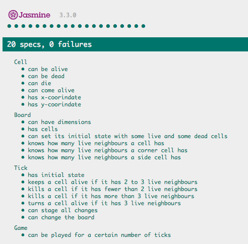

## Game Of Life


The Game of Life is a zero player game developed in the 70s by John Horton Conway. Check out the [wikipedia article](https://en.wikipedia.org/wiki/Conway%27s_Game_of_Life) for a full description. The evolving state of the game is determined by the initial configuration - some configurations become infinitely evolving constellations, others eventually evolve into a stable pattern, whilst others die off completely. The gif above is a copied in visual example, and is not the result of my work.

The rules are as follows:

- The game evolves in turns, commonly known as 'ticks'.
- All changes occur at the same time.
- Any live cell with 2 or 3 live neighbours survives until next tick.
- Any live cell with less than 2 live neighbours dies (underpopulation).
- Any live cell with more than 3 live neighbours dies (overpopulation).
- Any dead cell with exactly 3 neighbours becomes a live cell (reproduction).

## My Approach

I've built the business logic for the Game of Life, which consists of four interacting classes:
- Cell:
  - Cell knows whether it's dead or alive
  - It can be killed or brought to life
  - Cell has coordinates on a board
- Board:
  - Board has user specified dimensions
  - Board knows how many live neighbours a cell has
  - Board can be set up with a starting state that includes live and dead cells, set up at random
- Tick:
  - Tick can take an initial board state, analyse it, stage changes based on game rules, and then implement those changes by changing the board
- Game:
  - Game can be played for a certain number of ticks

## What I Would Do Next

- Allow game to run infinitely, stopping if steady state is reached
- Build visualisation

## How To Run and Test It

- Fork and clone this repo
- Load SpecRunner.html in the browser
- This will (a) show you the test coverage, (b) allow you to run the game from Dev Tools
- To interact with the code, open Chrome Dev tools and type in:

```game = new Game(2, 3, 3)```

- (The parameters are width of the board, height of the board and number of ticks the game should run for)

```game.play() ```

- To check the state of the board before and after the game runs, you can type in

```game.board```

- Test coverage:



## Tech Used and Dependencies

- The game is written in Javascript
- Jasmine is used for testing
